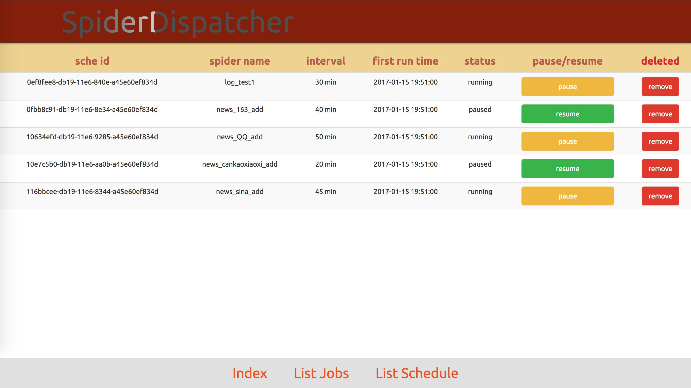

SpiderDispatcher
===
`SpiderDispatcher` is a visualized lightweight spider manage system base on `scrapyd` and `APScheduler`, 
easy to install and use, low resource occupancy. It's an original version, I'll optimizing it later ╮(╯▽╰)╭

Require
---

```
Python 2.7.x
MySQL >= 5.6
```

Install
---

```
git clone git@gitlab.com:pangguangde/SpiderDispatcher.git
cd SpiderDispatcher
pip install -r requirements.txt
```


Configure
---
**Edit** `SpiderDispatcher/settings.py` according to your own situation.

check out database `test` in your MySQL, create it if not existed.

**notice** how to judge `IS_DEV` is important  ╮(╯▽╰)╭

Run
---

```
cd $YOUR_SPIDER_PROJECT_DIR
scrapyd
cd SpiderDispatcher
python SpiderDispatcher.py
open url http://0.0.0.0:4399/
```

shortcuts
---
**Index:**


**List Jobs:**


**List Schedule:**


Other
=====
**Any questions or suggestions you can contact me via email** `muyuguangchen@gmail.com` **or just remind me in Issues, 
THX ╮(╯▽╰)╭**

<p style="font-size: 3em"><b>Enjoy your crawling!</b></p>


